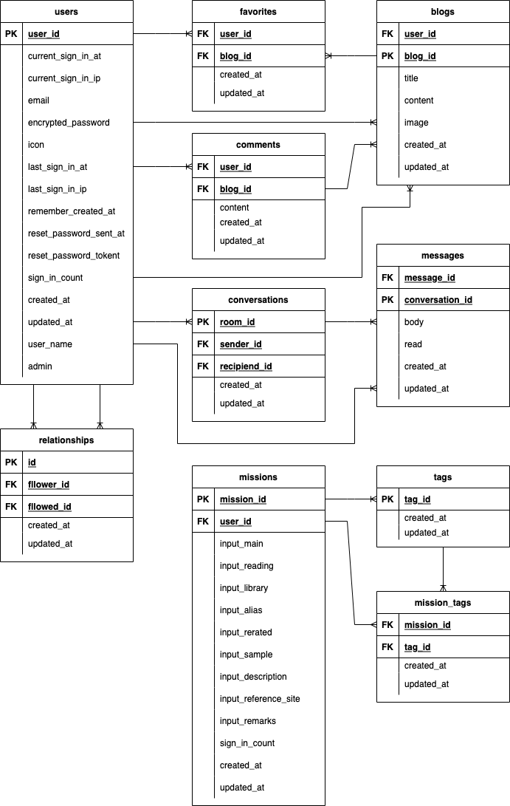
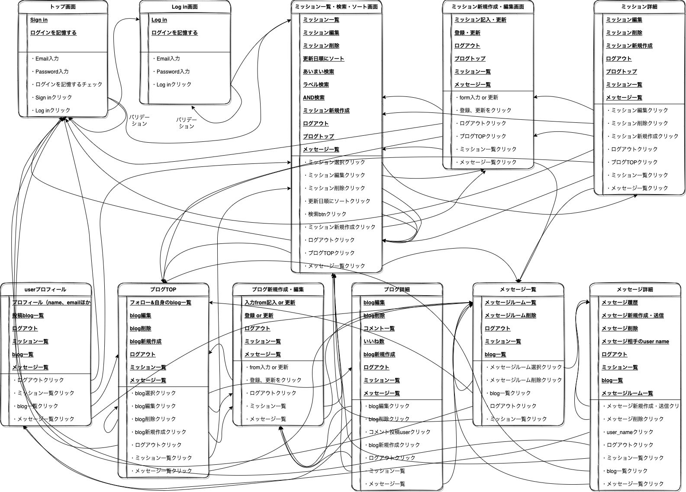
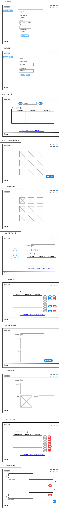

#README
___
# 開発言語
* Ruby 3.0.1
* Ruby on Rails 6.0.4.4

## 就職Termの技術
___
* devise
* Ajaxを使ったコメント機能
* フォロー機能
* メッセージ機能
* お気に入り機能

## カリキュラム外の技術
___
* ransack

## 実行手順
___
```
$ git clone git@github.com:Hanada-Takao/program_mission.git
$ cd program_mission
$ bundle install
$ rails db:create
$ rails db:migrate
$ rails db:seed
$ rails s
```
## チェックシート
___
https://docs.google.com/spreadsheets/d/1KMmfs3DjdpkPlvS8zEgQSb5CPxUAWzTF/edit?usp=sharing&ouid=104510662874081184366&rtpof=true&sd=true
## カタログ設計
___
https://docs.google.com/spreadsheets/d/1DZBlikKWubm4-TyE5gAGeG_v0JVxqz6jBqCMyEdX1zw/edit?usp=sharing

## テーブル定義書
___
https://docs.google.com/spreadsheets/d/1ZQVe23hevCW-NOATDkT9f6OhtpmlJrOPtl_acl5QbH4/edit?usp=sharing

## ER図
___
https://drive.google.com/file/d/1Zn1GGHBUoXYGChN9R-uS92PQM0VbnSIj/view?usp=sharing

## 画面遷移図
___
https://drive.google.com/file/d/1GKOARfjqK96VoTI3-tfUF3pkU99C4nIM/view?usp=sharing

## ワイヤーフレーム
___
https://drive.google.com/file/d/1niAp7eLyiT6YWnH7bdRI7eN2N_mabQZi/view?usp=sharing
